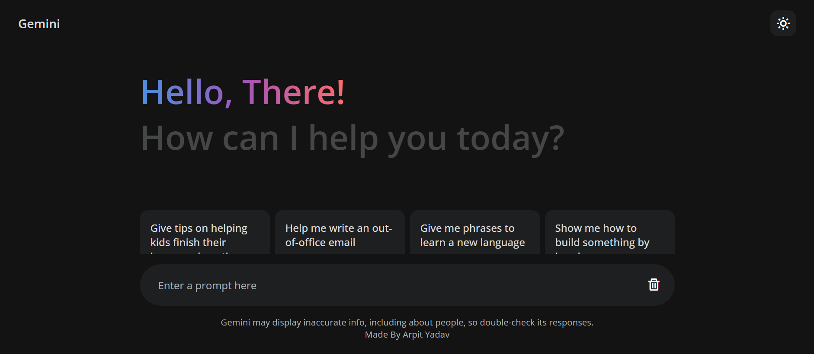

## Warning
You need to get your own **API Key** and replace it in script.js file on line 12 :

```javascript
const GOOGLE_API_KEY = "YOUR_API_KEY";
```
#### 💻 Technologies that I used
    

# Screenshot
Here we have project screenshot :


